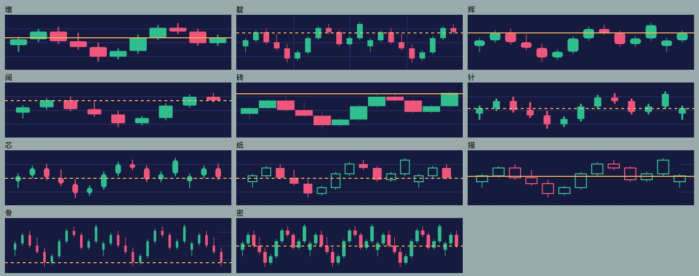

# 看盘 · Kanpan

一个只做四件事的原生 iOS 实时看盘 app：**品种、周期、K 线、指标**。

数据源是币安 USDT 本位永续合约，手感对标 AICoin 手机端。图表引擎自绘（UIKit + CoreGraphics），不用 TradingView，不用任何图表库，零第三方依赖。

做这个的原因很简单：现有的手机看盘 app 要么塞满广告，要么在手机上拖不动、捏不顺。这个只留下看盘本身。

## 现在的状态

设计已定版，Swift 实现还没开始。仓库里是**完整的规格**：一份可运行的交互原型，和一份写到可以照着敲代码的实施任务书。

| 位置 | 是什么 |
|---|---|
| [`prototype/看盘原型.html`](prototype/看盘原型.html) | 单文件可运行原型，内嵌 2026-09-14 的币安真实行情快照，**双击打开、断网也能玩**。手指拖、双指缩放、长按十字线、切周期、开指标、画线，全是真的 |
| [`prototype/src/`](prototype/src/) | 原型源码。`chart.js` 是自绘图表引擎，`styles.js` 是 11 款 K 线风格的几何表和配色，Swift 侧一比一移植它们 |
| [`docs/实施任务书.md`](docs/实施任务书.md) | 架构、数据层、图表算法、手势物理、指标数学、性能预算、10 个里程碑和 130 条验收标准 |
| [`docs/开工提示词.md`](docs/开工提示词.md) | 给 AI 编码助手的开工提示，整段粘过去就能接手 |
| [`docs/截图/`](docs/截图/) | 原型参考截图：主屏、十字线、各面板、横屏、11 种风格 |



## 已经定死的事

这些不再讨论，实现时照做：

- 图表类型永远只有蜡烛一种。「风格」换的是蜡烛本身——实体占几成、影线多粗、端头平还是圆、是否空心或只描边，连同间距和留白一起换，共 **11 款**，默认「墩」。
- 配色只有一套：**靛**，浅色深色各一版。
- 周期 **14 档**（1m 3m 5m 15m 30m 1h 2h 4h 6h 12h 1d 3d 1w 1M），默认 1h。**切周期时 K 线像素宽度不变**，变的是可见时间跨度。
- 副图默认 MACD + RSI，主图默认 MA(7, 25, 99)。
- **K 线行情不永久落盘**：只有内存 LRU 缓存和一份 ≤ 60 KB 的启动快照。但体验优先，为流畅该用的内存就用。
- Swift 6、iOS 17+、SwiftUI 外壳 + UIKit 自绘图表，`KanpanCore` 纯 Swift 包（无 UIKit，命令行 `swift test` 可验）+ `Kanpan` app target。

## 怎么开工

```bash
git clone https://github.com/Graham-lo/kanpan.git && cd kanpan
open prototype/看盘原型.html      # 先玩一遍原型，这是规格本身
```

然后读 [`docs/实施任务书.md`](docs/实施任务书.md) 开头的「开工须知」，按 §15 的顺序从 M0 做起。

## 一起做

欢迎 issue 和 PR。开工前请先看一眼任务书里已经定死的部分——提案改动那些的 PR，麻烦在描述里说明理由。每个里程碑都有明确的验收标准（§12、§13），PR 请附上对应的证据。

原型与任务书是规格，`prototype/` 和 `docs/` 只读；代码写在 `KanpanCore/` 和 `Kanpan/` 里。
