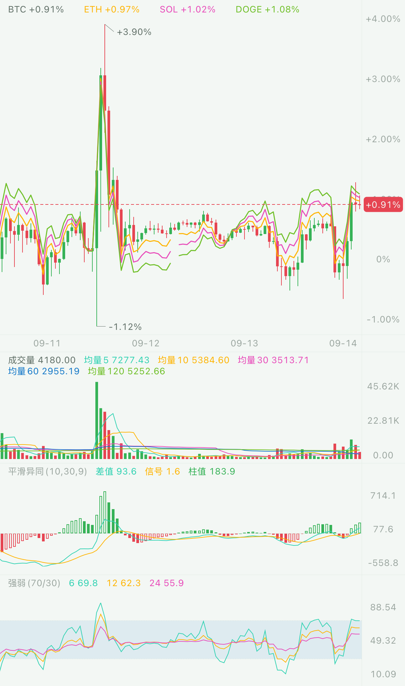

# 对比 K 线 · 阶段 1（2026-09-22）

状态：已完成。代码为 main 上「对比K线阶段一：按可视开盘价统一百分比渲染」与「修正对比冷启动验收的隔离档案标识」两条提交（原分支上是 7b5bd46 / fa74866，rebase 后换了号）；本文与证据随阶段 2 一起推上 main。

## 交付范围

- `ChartState.compare` / `percentAxis` 为纯值；对比行情包含完整品种 key、短名、皮肤色板颜色及按主序列下标对齐的可空开盘、收盘数组。
- 主品种保留蜡烛，对比品种画收盘折线。基点为可视左端对应 K 线的原始开盘价；各对比使用同一 openTime 的自身开盘价。平移、缩放重新定基；缺根断线，缺基点整条为空，不插值。
- 右轴、最新价、十字线、极值和图例共用百分比坐标；正数带 `+`、两位小数、零为 `0%`。图例放在现有主图区域，十字线选择对应根的读数，预留固定读数宽度以保持几何稳定。
- 渲染百分比分支隐藏价格指标、画线及价格盘口叠加；退出后沿用原有设置。副图继续计算主品种。数据订阅、入口及持久化在阶段 2 接入，交互入口互斥在阶段 3 收口。

## 检查

| 检查 | 结果 |
| --- | --- |
| Core | 366 条 Swift Testing + 4 条 XCTest，通过 |
| Network | 106 条，通过 |
| Data | 189 条 Swift Testing + 3 条 XCTest，通过 |
| app-logic | 445 条，通过 |
| Rust lib | 155 条，通过 |
| 完整应用模拟器构建（arm64） | BUILD SUCCEEDED |
| KanpanChart 模拟器单测 | 131 条 Swift Testing（21 组）+ 4 条 XCTest，通过 |

`CompareChartTests` 覆盖基点重定、缺根/缺基点、零及正负标签、蜡烛/十字线/右轴共用坐标、图例不触发几何重建、三条对比夹具渲染。图表包依赖 UIKit，使用专用 iPhone 16 Pro · compare / iOS 26.5 运行 `xcodebuild test`；其它包使用 `swift test`。

一次并行复验中，原有 Data「读快照 + 建 BarSeries <20ms」测到 64.9ms；同一源码以 `--no-parallel` 顺序复跑，全包通过。未放宽门槛。SwiftPM 共用 scratch 目录时关闭 build manifest 缓存，并核对实际 suite 和测试数。最终命令摘要见 [阶段1-验证.txt](阶段1-验证.txt)。

## 性能证据

- 改前冷启动：专用模拟器全新安装，BTC 1m，从启动到首批主图数据 **20.2885s / 1,500 根**。此时没有对比订阅，是改前基线；[原始日志](冷启动-改前/iPhone-16-Pro.log)。用例的档案名已修正为有效 UUID；该次基线由脚本先卸载应用，仍是空本地数据启动。
- A3.12 不含对比：Instruments 0.000%、ps 0.000%（32.039s；ps 分辨率上限约 0.031%），[结果](CPU-改前/结果.log)。
- A3.12 三条对比：独立逐秒读取进程 CPU 时间，实际墙钟 36.812s，CPU 增量 0.000s，即 **0.000%**（分辨率上限约 **0.027%**），低于 1%；[结果](CPU-对比/结果.log)、[逐秒采样](CPU-对比/A3.12-ps-samples.csv)。
- DisplayLink：31 次采样全部暂停，timestamp 只有一个值；[原始探针](CPU-对比探针/A3.12-displaylink.log)。
- Instruments 的对比轮出现启动卡住及录制后导出卡住，未获得有效 trace，**未计为通过**；保留[导出失败日志](CPU-对比/Instruments-导出未完成.log)。对比轮 CPU 结论来自上述独立 ps 计时与暂停探针。取证宿主排除行情与业务计时器，测量图表静止开销。

冷启动墙钟包含应用启动及 XCUITest 观测开销；机器同时运行其它工作树的构建，不能把该值当成网络 RTT。改后同设备、同周期、三条对比的首屏时间写入阶段 2 报告。

## 假设与边界

- 可视左端按照现有 `BarSeries.index(atTime:)` 命中规则选根；不另设固定日期起点。平均 K 线模式也使用原始市场开盘价作为基准。
- 比较期间价格盘口叠加与其它价格叠加一起暂隐，设置不变；没有改动盘口订阅、数据、缩放或十行绘制实现。
- 原入口 `.project-memory/CODEX.md` 不存在，按现存 `AGENTS.md` / `README.md` / `.project-memory/PROJECT.md` 恢复上下文。
- 仅在指定工作树修改，使用专用模拟器。未部署服务端、未改网络配置；没有真机验收。
