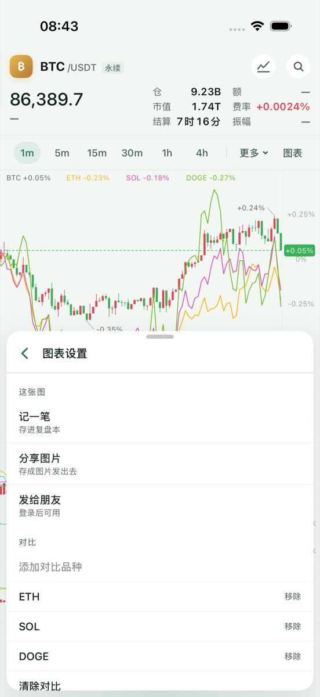
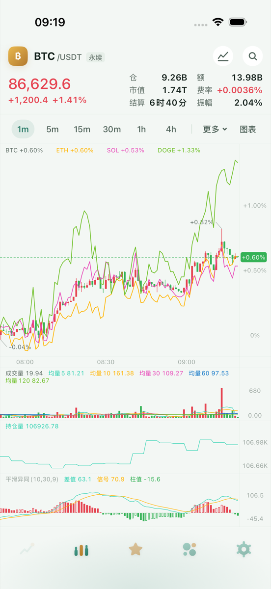

# 对比 K 线 · 阶段 2（2026-09-23）

状态：已完成。代码提交见本文所在提交之前的「对比K线阶段二」与「图表读屏念品种代号」两条；服务端已部署（见文末）。

## 交付范围

- **数据**：`KanpanData/Sources/KanpanData/Feed/CompareFeed.swift`（actor）按主图周期拉对比品种的 REST 历史，订阅合流 WS 末根；非原生周期走 `Aggregator` 同一路；按同一 `openTime` 对齐到主序列下标，缺根留空、不插值。首屏只拉可视所需，左侧回填与断线补尾在后台做。依赖注入与 `MarketFeed` 同形（REST/WS 可由外部注入，测试用回放；应用里按主图同一份 `MarketRoutePolicy` + `BinanceHosts` 建）。
- **模块**：`Kanpan/Kanpan/Compare/CompareModel.swift` 把订阅收成一个模块，宿主只给「主品种 + 周期 + 集合」；前后台切换暂停 / 恢复，离开主屏即停。
- **入口**：「图表」面板新增「对比」一节：「添加对比品种」→ 现有品种搜索（行尾报价照常刷新）；已加的每只一行、行尾「移除」；满 3 只时「添加」置灰；最下「清除对比」。主品种与重复品种不进集合。
- **持久化 / 同步**：`Prefs.compareSymbols`（完整品种 key 数组）登记进 `PrefsFieldPlan` → `make sync-contract` → `Backend/kanpan-api/contract/settings-fields.json`；服务端 `sync.rs SETTINGS_FIELDS` 与 `sync_validation.rs` 同步加上（至多 3 只、互不重复、必须是 `binance/usd_m/…` 这类完整 key）。两端契约测试对账一致。
- **对比期间**（部分收口提前到本阶段，阶段 3 验收）：画线入口置灰、价格叠加与「按此价画线」隐藏；复盘截图 / 打开 / 匹配都剥掉对比。
- **读屏修正**（验收发现的真 bug）：图表读屏把完整 key 念成「binance/usd_m/BTCUSDT，1 小时…」。`ChartView+Accessibility.swift:31` 与 `ChartView.swift:222` 改成念 `InstrumentID(…).symbol`。全仓查过其它把内部 ID 当显示文案的地方：分享卡 / 发给朋友用 `shortSymbol`，提醒标题用 `base(of:)`，复盘到期通知用 `shortSymbol`，对比图例用 `.base`，横屏与画线品种切换已是 `InstrumentID(…).symbol`，服务端提醒标题兜底用的是客户端发来的裸代号——都没有问题，只修了读屏这一处。

## 检查

| 检查 | 结果 |
| --- | --- |
| 完整应用模拟器构建（arm64） | BUILD SUCCEEDED |
| Core | 374 条 Swift Testing + 4 条 XCTest，通过 |
| Network | 114 条，通过 |
| Data | 206 条 + 3 条 XCTest；`--no-parallel` 全包一次在负载 40+ 下挂 1 条既有计时用例（`TwoStageFetchTests`「小页先把图画上」3s 等待），同源码单独复跑通过；未放宽门槛。新增 `CompareFeedTests` 7 条全过 |
| app-logic（symbols/sector/settings/diag/account-codec/deeplink/scan/alerts） | 全过（含 `ComparePrefsTests`、`CompareSyncTests`） |
| account | 65 条，通过 |
| KanpanChart（独立 derivedData `/tmp/compare-dd-chart`，专用模拟器） | 145 条 Swift Testing + 4 条 XCTest，通过（含读屏用例 `ChartGestureTests.swift:136`） |
| Rust lib | 161 条，通过（`every_wire_key_has_a_value_rule` 加了完整 key 探针） |
| sync-contract | 通过 |
| UI：`CompareUITests/testPanelCollectionPersistsAndClears` | 通过：加满 3 只、「添加」置灰、重启后集合仍在、十字线读数与右轴一致、0% 在刻度内、清除后回价格坐标 |
| UI：`ComparePerformanceUITests/testColdStartOneMinute` | 通过，数据见下 |

## 冷启动（BTC 1m + ETH/SOL/DOGE）

同一台专用模拟器（iPhone 16 Pro · compare / iOS 26.5）、每轮先卸载应用（空缓存、全新档案），「不带对比」与「带 ETH/SOL/DOGE 三条对比」背靠背交替各 4 轮（用例的 `COMPARE_BASELINE` 开关），时间从启动到主图 1m 首屏 ≥100 根可画：

| 轮次 | 不带对比 主图 | 带三条对比 主图 | 带三条对比 三条都可画 |
| --- | --- | --- | --- |
| 1 | 16.18s | 11.54s | 12.74s |
| 2 | 7.90s | 17.17s | 18.28s |
| 3 | 14.73s | 19.61s | 20.72s |
| 4 | 13.97s | 12.24s | 14.49s |
| 中位数 | **14.35s** | **14.71s** | **16.38s** |

- 两组区间完全重叠（不带对比 7.9–16.2s、带对比 11.5–19.6s），差值在单组自身波动之内；机器同时跑着别的工作树构建（负载 25–45）。阶段 1 记的改前 20.29s 是另一时段、另一负载下的单次值，不拿来直接比。
- 机制上对比也拖不了主图首屏：`CompareModel.configure` 在主序列为空时不建 `CompareFeed`，对比的 REST 与 WS 都在主图首屏数据落地之后才发出去。三条对比在主图之后 1.1–2.3s 全部可画。
- 原始输出：[阶段2-冷启动/结果.log](阶段2-冷启动/结果.log)。

## 假设与边界

- 对比集合随账号同步，但复盘快照不带它；扫图扫到集合里的品种时这张图临时忽略该品种（集合不变，扫回来恢复）。
- 对比行情走与主图相同的线路选择（直连 / 网关），自己开一条合流 WS 装全部对比品种，不改主图那条连接。
- 没有真机验收（真机签名坏了，按规矩不装）。
