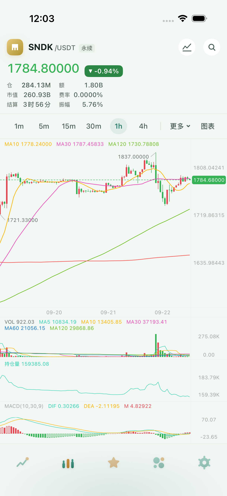
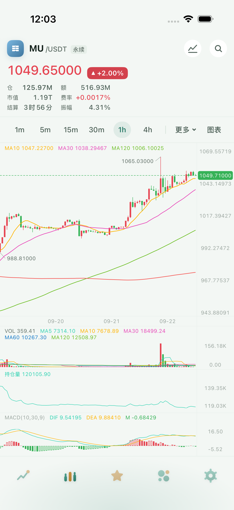
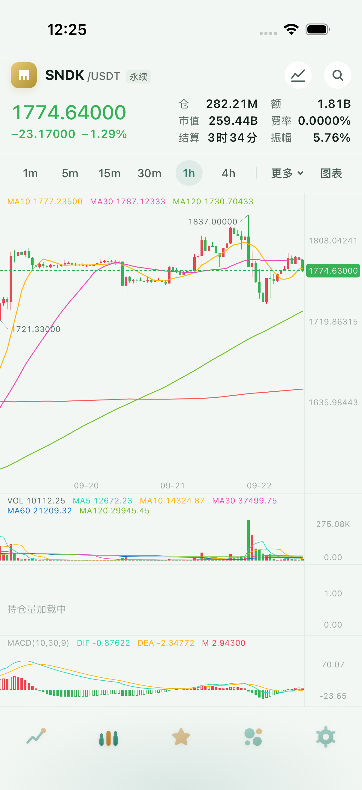
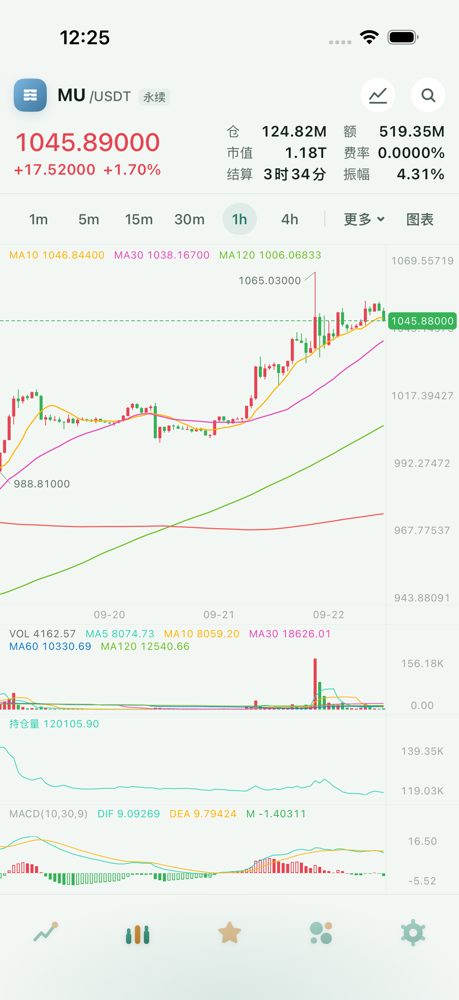
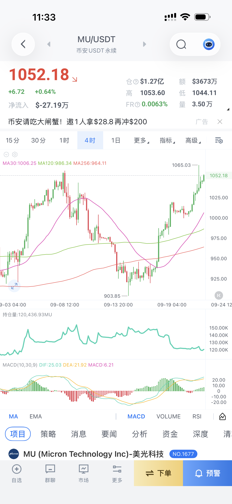

# P0 · 行情页头部验收

提交号：`fd6a8f6`（代码与回归用例，已推送 `origin/main`）。本报告与截图是该提交的配套证据。

基准：`bd4e822`；相对 `9aa6372` 仅增加另一窗口的桌面原型，P0 未改动该原型。本阶段已完成模拟器验收，未做真机验收。

## 做了什么

- 删除按宽度分档及药丸：只有左侧价格 / 涨跌小字、右侧两列三行统计这一种布局。保留三个可访问标识和整块价格区的扫图手势。
- 价格 22pt medium；涨跌行 13pt semibold，涨跌额与涨跌幅之间两个空格，沿用涨跌文字色。六格标签 12pt、值 13pt semibold，列间距 14pt、格内间距 6pt、行距 3pt；缺数统一 `—`，不足一分钟 `<1分`。
- REST `priceChange`、单品种与全市场流 `p` → `Ticker.priceChange` → `QuoteState` / `QuoteBook.raw` → 头部。较新成交只补统计之后的价差；涨跌额变化会触发报价显示更新。快照扩展为可选字段，兼容旧文件。
- 头部的涨跌额和涨跌幅配对使用 24 小时统计；自选表的口径选择与药丸不变。
- `Tools/ui-test.sh` 增加单机和指定用例过滤，空参数保留完整矩阵；修复中文紧贴变量名导致失败分支汇总中断的问题。既有 M8 日志不属于本次提交。

## 假设与实测差异

- 闪迪、美光的真实报价已经是四位整数加五位小数，不能按早期文字里的“两位整数 + 两位小数”设计。四只验收品种均使用实际交易所精度与实际六格数据。
- `.xLarge` 封顶在 390pt 的 1000SATS 上仍超宽 16pt：价格左缘从 12pt 变成 4pt，统计右缘从 378pt 变成 386pt。依据 P0 D.13 下调一档，最终封顶为 **`.large`**，不引入分档、缩字或截字。
- 按最终规格的 12/13pt 字号和 3pt 行距，六格实际高度为 **53pt**；任务书“约 48pt”是旧字号的估值。保留指定字号和内边距，四只品种的头部高度与周期条位置一致，最大系统字号也不再额外长高。相对旧的已掉行头部减少约 31pt，相对旧的正常并排头部多 5pt。
- 为证明 P0 可以独立编译，从 `9aa6372` 建立并更新到 `bd4e822` 的 `/tmp/kanpan-p0-check` 验收工作树，只放 P0 变更。主工作树接管的 P1 开头及两个编译修复留待 P1 提交。

## 修前证据

使用 `Tools/ui-test.sh` 的单机过滤执行新增几何用例，四品种顺序为 SNDK、MU、1000SATS、BTC。旧实现产生 12 条预期断言失败；前三只统计左缘均为 12pt（在价格下方），周期条起点为 200.33pt，BTC 为 164.33pt。

| 闪迪修前 | 美光修前 |
| --- | --- |
|  |  |

原始复现图：[1000SATS](P0/screenshots/16pro-before-1000SATS-original.png)。

## 验证命令与结果

下列命令在 P0 独立工作树执行。命令日志均保存在 [P0/logs](P0/logs/)。

| 命令 | 结果 |
| --- | --- |
| `xcodebuild build -workspace Kanpan.xcworkspace -scheme Kanpan -destination 'generic/platform=iOS Simulator' -derivedDataPath /tmp/kanpan-p0-dd -jobs 2` | 退出 0，BUILD SUCCEEDED |
| `swift test --package-path KanpanCore -j 2` | 360 条通过 |
| `swift test --package-path KanpanNetwork -j 2` | 96 条通过 |
| `swift test --package-path KanpanData -j 2` | 184 条通过 |
| `swift test --package-path KanpanChart -j 2` | macOS 目标无法导入 UIKit；这不是图表测试通过的证据，实际验证用下一行 |
| `cd KanpanChart && xcodebuild test -scheme KanpanChart -destination 'platform=iOS Simulator,name=iPhone 16 Pro · m22' -derivedDataPath /tmp/kanpan-p0-chart-dd -jobs 2 -test-timeouts-enabled YES -maximum-test-execution-time-allowance 180` | 退出 0，125 条 Swift Testing + 4 条 XCTest 通过 |
| `make app-logic-test` | 退出 0，八包共 441 条通过 |
| `cd Kanpan/KanpanTests && xcodebuild test -scheme KanpanMain -destination 'platform=iOS Simulator,name=iPhone 16 Pro · m22' -derivedDataPath /tmp/kanpan-p0-main-dd -only-testing:KanpanMainTests/HeaderStatsTests -test-timeouts-enabled YES -maximum-test-execution-time-allowance 120` | 退出 0，头部逻辑 15 条通过 |
| `cd Backend/kanpan-api && cargo test --lib -j 2` | 退出 0，153 条通过 |

模拟器 UI 命令（测试脚本在实际运行时复制为同目录的固定快照 `Tools/p0-run.sh`，防止运行期间修改脚本影响解释器）：

```sh
ONLY_DEVICE='iPhone 16 Pro' \
ONLY_TESTING='KanpanUITests/MainScreenUITests/testHeaderStatsStayRightOfPrice,KanpanUITests/MainScreenUITests/testHeaderStatsAtLargestDynamicType' \
DD=/tmp/kanpan-p0-dd OUT=/tmp/kanpan-handoff-checks/p0-final-16pro \
RES=/tmp/kanpan-handoff-checks/p0-final-16pro-results bash Tools/ui-test.sh

xcrun simctl spawn ACAF005F-5561-4C64-836B-45E4FB3C5C72 defaults write -g UIAccessibilityBoldTextEnabled -bool YES
xcrun simctl spawn ACAF005F-5561-4C64-836B-45E4FB3C5C72 defaults read -g UIAccessibilityBoldTextEnabled
# 输出 1；随后用例重启 app。
ONLY_DEVICE='iPhone 17e' \
ONLY_TESTING='KanpanUITests/MainScreenUITests/testHeaderStatsStayRightOfPrice,KanpanUITests/MainScreenUITests/testHeaderStatsAtLargestDynamicType' \
DD=/tmp/kanpan-p0-dd OUT=/tmp/kanpan-handoff-checks/p0-final-17e-bold \
RES=/tmp/kanpan-handoff-checks/p0-final-17e-bold-results bash Tools/ui-test.sh
```

两条命令均退出 0，各 2 条 UI 用例通过。每条分别深链打开 SNDK、MU、1000SATS、BTC；等待价格、市值、成交额、费率实值到齐，再断言六格在右侧、涨跌行在价格正下方且左对齐、左右 12pt 留白仍在、涨跌行与六格相隔至少 8pt，以及四品种的六格高度与周期条位置相等。最大字号用例通过系统启动参数 `UICTContentSizeCategoryAccessibilityXXXL` 请求，并额外断言价格 / 六格高度与默认档相同。

| 最终机型 / 设置 | 六格高度 | 周期条起点 | 结果 |
| --- | --- | --- | --- |
| iPhone 16 Pro，默认字号 / 最大字号 | 四只均 53pt | 四只均 169.33pt | 2/2 通过 |
| iPhone 17e，粗体 + 默认字号 / 粗体 + 最大字号 | 四只均 53pt | 四只均 154.33pt | 2/2 通过 |

iPhone 17e 未开粗体的默认字号也已通过一次；该轮的 `.xLarge` 探测失败单独保留在 `xLarge-probe-17e.log`，由最终 `.large` 复验收口，未将失败算成通过。

## 修后截图与参照

| 闪迪修后 | 美光修后 |
| --- | --- |
|  |  |

| Hkline 闪迪（修后） | AICoin 原始参照 |
| --- | --- |
|  |  |

骨架一致：左侧大字价格及紧贴下方的涨跌小字，右侧数据格；Hkline 保留自己的六格字段和既定取数口径。截图为模拟器 / 用户参照的原始文件，未重绘数字或裁掉边界。

其余截图：`P0/screenshots/16pro-after-{default,AX3}-<symbol>.png` 与 `P0/screenshots/17e-after-{bold-default,bold-AX3}-<symbol>.png`，每组包含四只品种。最窄屏、粗体、最大字号同时开启的 [1000SATS](P0/screenshots/17e-after-bold-AX3-1000SATSUSDT.png) 仍保留两侧留白；失败的 `.xLarge` 对照另存 `17e-xLarge-AX3-1000SATSUSDT.png`。

## 后端与真机

本阶段没有后端代码、数据库或网关改动，不涉及部署；`cargo test --lib` 153 条通过。没有将本地编译当成线上部署或真机验证。按用户要求，真机安装与账号、密钥检查均未进行。
