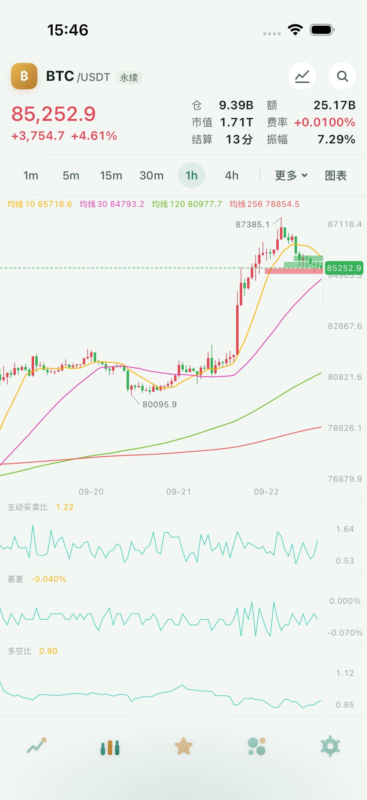
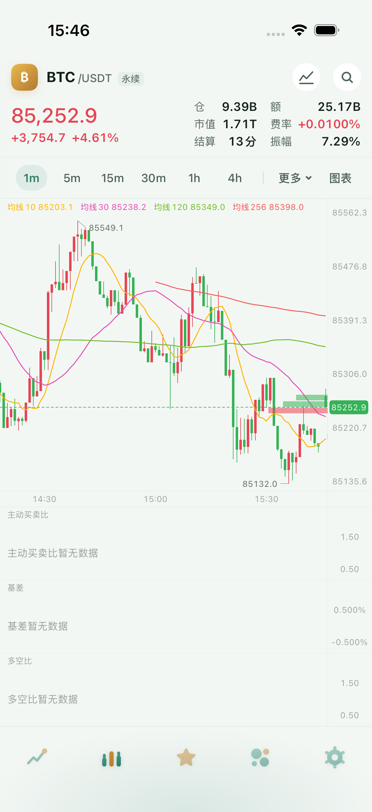

# P1 返工 1 · 固定十行盘口梯

前置提交：原本地P1 `5742db3` 已重放到 `6fd70e8`，以 `d4f5e2f` fast-forward 推送。初版三副图通过独立验收，盘口因按价位绘制而不可见被打回。本报告记录单独的盘口返工。

## 实现与假设

- 卖五在上、买五在下；卖一与买一紧邻最新价分界。固定每行6pt、行距1pt，完整十行共69pt。最长量柱64pt，其余严格按十档最大数量的比例缩放；跌色画卖盘、涨色画买盘，不透明度0.55，无文字。
- 通常以最新价所在y为中心；上下空间不足时整架平移进主图。依据交接书“整架夹进图区”，边缘场景允许中间空隙随梯子一起平移，最新价横线与价格范围均保持原值。
- 图表几何、轴宽、价格范围不含盘口输入；深度帧仍只使实时层失效。关闭最新价横线仍可显示盘口梯。
- DEBUG探针 `renderedDepthRows` 在实时层真正调用绘制后取返回值，不拿收到的盘口档数充当绘制证据。UI断言BTC一小时、一分钟均实际绘制十行，切线路或关开关后为零。
- 新回归测试用相差0.1的密集十档验证行高、行距、颜色顺序、64pt比例、两端夹入以及实际像素面积/透明度，保留原“不改几何、只刷实时层”的测试。

## 验证

应用通用模拟器构建、双架构测试包构建通过；Core366条Swift Testing + 4条XCTest、Network106、Data189、应用逻辑445、图表129条Swift Testing + 4条XCTest、Rust155全部通过，原始输出在 `logs/`。受影响UI用例1条通过、0失败，498.279秒；脚本最终成功，见 `ui/summary.txt`。BTC两个周期十行实际绘制、20次切品种、网关空态以及关闭后绘制归零均通过。首轮编译时新文件调用了另一文件的私有坐标函数，已改用同一公共价格坐标换算，首轮失败原文保留于 `logs/chart-first-build.log` 和 `ui-first-build/build.log`。

命令：

```sh
xcodebuild build -workspace Kanpan.xcworkspace -scheme Kanpan -destination 'generic/platform=iOS Simulator' -derivedDataPath /tmp/kanpan-p1-dd CODE_SIGNING_ALLOWED=NO
(cd KanpanChart && xcodebuild test -scheme KanpanChart -destination 'platform=iOS Simulator,id=8C9E429F-4135-4D82-BFD6-6AF577B999FA' -derivedDataPath /tmp/kanpan-p1-chart-dd -jobs 2 -test-timeouts-enabled YES -default-test-execution-time-allowance 180 -maximum-test-execution-time-allowance 300)
ONLY_DEVICE='iPhone 16 Pro' SUFFIX=' · p1-ui' ONLY_TESTING='KanpanUITests/ChartFoundationUITests/testExternalIndicatorsAndDepthRoundTrip' DD=/tmp/kanpan-p1-dd RES=/tmp/kanpan-p1-rework-ui-results OUT=docs/acceptance/待办交接-2026-09-22/P1/rework-1/ui Tools/ui-test.sh
swift test --package-path KanpanCore --jobs 2
swift test --package-path KanpanNetwork --jobs 2
swift test --package-path KanpanData --jobs 2
make app-logic-test CORE_TEST_FLAGS='--jobs 2'
cargo test --lib --manifest-path Backend/kanpan-api/Cargo.toml
```

仅修改客户端图表、用例和文档，本轮无后端部署。所有界面证据来自模拟器。

后端只读验证：元数据、能力接口、BTC同一历史范围的六列/两列归档均200，响应原文及UTC时间见 [backend-readonly.log](logs/backend-readonly.log)。没有写入生产数据。


## 原始截图

已打开以下两张模拟器原图检查：盘口从细线变为固定间隔的量柱，均在主图右侧、刻度列左边。颜色跟随当前涨跌色约定；本次皮肤是红涨绿跌，所以卖盘为绿、买盘为红。真实十档数量悬殊时部分柱长接近零，保留数量比例，不用虚构的最小数量放大挂单。十行的存在、间距与绘制面积另由渲染探针及像素测试约束。





其它原始截图：[三副图](screenshots/三副图-多空比-主动买卖比-基差.png)、[网关空态](screenshots/网关-三副图空态.png)、[盘口关闭](screenshots/盘口关闭-回到普通图表.png)。一分钟截图取自刚切周期且盘口已绘制的时刻，外部统计仍在载入；三副图完整曲线见单独截图和初版验收。

本返工源码散列见 `logs/source-sha256.txt`，原始xcresult路径为 `/tmp/kanpan-p1-rework-ui-results/iPhone-16-Pro.xcresult`。未修改订阅、同步字段、后端源码或其它线程范围；旧M8日志不在提交范围。
